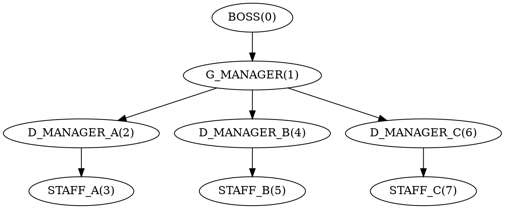
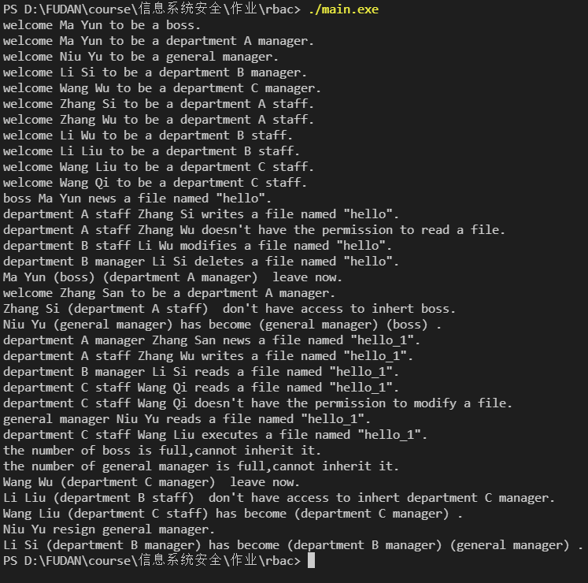

## 
概述

​&emsp;&emsp; 编程语言：C++

​&emsp;&emsp;代码编码方式：utf-8

​&emsp;&emsp;编译方式：g++ -o main main.cpp User.cpp Role.cpp Permission.cpp

​&emsp;&emsp;文件介绍：

- Permission.h & Permission.cpp ：声明和定义权限对象及其相应数据结构和函数。
- Role.h & Role.cpp ：声明和定义角色对象及其相应数据结构和函数。
- User.h & User.cpp ：声明和定义用户对象及其相应数据结构和函数。

## ​
数据结构介绍

### 权限(Permission)

​&emsp;&emsp;`class`实现，存有权限id和权限信息。

### 角色(Role)

​&emsp;&emsp;`class`实现，存有角色id和角色名。

### 用户(User)

​&emsp;&emsp;`class`实现，存有用户id和用户名。

### 权限表(permission_table)

​&emsp;&emsp;`vector<Permission>`实现，保存权限id和权限的对应关系。

|权限id|权限信息|
|:-:|:-:|
|NEW(0)|新建一个文件|
|READ(1)|读一个文件|
|WRITE(2)|写一个文件（针对新建的文件）|
|EXECUTE(3)|执行一个文件|
|DELETE(4)|删除一个文件|
|MODIFY(5)|修改一个文件（针对已经写过的文件）|

### 角色表

​&emsp;&emsp;`vector<Role>`实现，保存角色id和角色的对应关系。

|角色id|角色信息|
|:-:|:-:|
|BOSS(0)|老板|
|G_MANAGER(1)|总经理|
|D_MANAGER_A(2)|A部门经理|
|STAFF_A(3)|A部门职员|
|D_MANAGER_B(4)|B部门经理|
|STAFF_B(5)|B部门职员|
|D_MANAGER_C(6)|C部门经理|
|STAFF_C(7)|C部门职员|

​&emsp;&emsp;其中部门A负责创建文件，部门B负责修改文件，部门C负责执行文件。

### 角色计数表

​&emsp;&emsp;`map<int,pair<int,int>>`实现,保存各个角色的数量限制和当前数量。

|角色id|角色数量限制|角色当前数量|
|:-:|:-:|:-:|
|BOSS(0)|1|
|G_MANAGER(1)|1|
|D_MANAGER_A(2)|1|
|STAFF_A(3)|5|
|D_MANAGER_B(4)|1|
|STAFF_B(5)|5|
|D_MANAGER_C(6)|1|
|STAFF_C(7)|5|

### 角色权限关联表

​&emsp;&emsp;`map<int,vector<int>>`实现，保存各角色与权限的对应情况。

|角色id|角色权限集合|
|:-:|:-:|
|BOSS(0)|所有权限|
|G_MANAGER(1)|所有权限|
|D_MANAGER_A(2)|新建(0)，读(1)，写(2)|
|STAFF_A(3)|新建(0)，写(2)|
|D_MANAGER_B(4)|读(1)，删除(4)，修改(5)|
|STAFF_B(5)|读(1)，修改(5)|
|D_MANAGER_C(6)|读(1)，执行(3)，删除(4)|
|STAFF_C(7)|读(1)，执行(3)|

### 角色继承关系表

​&emsp;&emsp;`map<int,vector<int>>`实现，记录角色之间的继承关系。

|角色id|可继承该角色的角色|
|:-:|:-:|
|BOSS(0)|总经理（1）|
|G_MANAGER(1)|部门经理（2，4，6）|
|D_MANAGER_A(2)|A部门职员（3）|
|STAFF_A(3)|无|
|D_MANAGER_B(4)|B部门职员（5）|
|STAFF_B(5)|无|
|D_MANAGER_C(6)|C部门职员（7）|
|STAFF_C(7)|无|

### 角色互斥关系表

​&emsp;&emsp;`map<int, vector<int>>`实现，记录各角色可以和哪些角色一起出现在同一个用户上。

|角色id|可与该角色一起出现在同一个用户上的角色|
|:-:|:-:|
|BOSS(0)|总经理（1），部门经理（2，4，6）|
|G_MANAGER(1)|老板（0），部门经理（2，4，6）|
|D_MANAGER_A(2)|老板（0），总经理（1），B、C部门经理（4，6）|
|STAFF_A(3)|无|
|D_MANAGER_B(4)|老板（0），总经理（1），A、C部门经理（2，6）|
|STAFF_B(5)|无|
|D_MANAGER_C(6)|老板（0），总经理（1），A、B部门经理（2，4）|
|STAFF_C(7)|无|

### 用户表

​&emsp;&emsp;`map<int,User>`实现，记录用户id和用户的对应关系。

|用户id|用户|
|:-:|:-:|
|0|id为0的用户|
|1|id为1的用户|
|2|id为2的用户|
|……|……|

### 用户角色关联表

​&emsp;&emsp;`map<int,vector<int>>`实现，记录用户和角色间的对应关系，一个用户可以有多个角色。

|用户id|用户拥有的角色|
|:-:|:-:|
|0|角色a0，角色b0，···|
|1|角色a1，角色b1，···|
|2|角色a2，角色b2，···|
|……|……|

## ​
RBAC要求及其实现

​&emsp;&emsp;此处只阐明思路，具体实现见代码。

### 对主体、角色、权限进行定义和配置

​&emsp;&emsp;这一点上面已经说了，不再赘述。需要注意的是用户和权限间没有直接关系，是通过赋予用户角色来实现赋予用户权限。

### 对角色进行授权

​&emsp;&emsp;利用上面的角色权限关联表即可对角色授权。

### 对角色的访问权限进行控制

​&emsp;&emsp;在用户对象`User`中定义了五个操作：新建文件、写文件、读文件、更改文件、删除文件和执行文件，分别对应了五个函数。每个操作在执行前都会检查用户当前角色是否有权限进行此操作。

​&emsp;&emsp;代码中通过`check_role_permission`函数实现对角色权限的检查。检查时会判断角色所拥有的权限集合是否包含指定权限，包含返回true，否则返回false。在执行操作前会调用该函数检查权限，如果用户当前角色具有指定权限则进行该操作，否则报错，禁止执行该操作。

### 对角色的层次关系进行分配控制

​&emsp;&emsp;上面的角色继承关系表就给出了角色的层级关系：

### 对角色权限继承进行管理

&emsp;&emsp;在用户对象（User类）中定义了继承特定角色的操作。通过`User::inherit`函数实现，在继承前会利用角色继承表进行检查，如果用户的某一个角色满足继承指定角色的要求，即可赋予该用户指定角色；如果用户没有一个角色满足继承要求，则报错，禁止继承该角色。
​
​&emsp;&emsp;可以看到，角色的继承有两个条件：
1. 只有角色r的下一级角色才能继承角色r。
2. 只有当角色r具有某角色的所有权限时，该角色才能继承角色r。

### 对角色约束（互斥）条件进行检查

​&emsp;&emsp;在上面的角色互斥关系表中规定了一个角色可以和哪些角色被同时赋予给同一个用户。在调用`User`的构造函数前，会对要赋予用户的角色集合进行检查，如果其中两个角色互斥，则报错，终止程序；用户在调用`User::inherit`函数继承某个角色时，会遍历用户当前的角色，判断是否有与该角色互斥的，如果有，删除与该角色互斥的角色，然后将该角色赋予该用户；当用户执行五个操作时，不管用户有几个角色，都只能以其中一种身份去执行操作，具体实现为五个操作函数都有一个参数r，用户需要利用参数r来指明自己要以什么角色去做这个操作，操作函数中会检查用户是否真的拥有该角色。

​&emsp;&emsp;可以看到，角色的互斥规则有：
1. 互斥的角色不能同时赋予同一名用户。
2. 用户在执行操作时只能以一个角色的身份去执行操作。

## ​
其他的一些实现

### 辞职操作

​&emsp;&emsp;`User`类中定义了一个resign函数实现用户主动放弃自己的某一个角色。
### 对角色的数目进行限制
​&emsp;&emsp;这显然是必要的，否则很容易出现多个老板、总经理或者部门经理，这是不合理的。所以如上文所说，我建立了一个角色计数表，其中记录了各角色的数目限制和当前数目。在创建用户、继承角色时都会查看角色的数目是否已经达到了上限，如果达到上限则报错并终止操作；在用户创建、辞职、离开和继承时都会更新相应角色的数目。

## ​
测试结果

​&emsp;&emsp;具体测试代码在main.cpp中。结果为：

